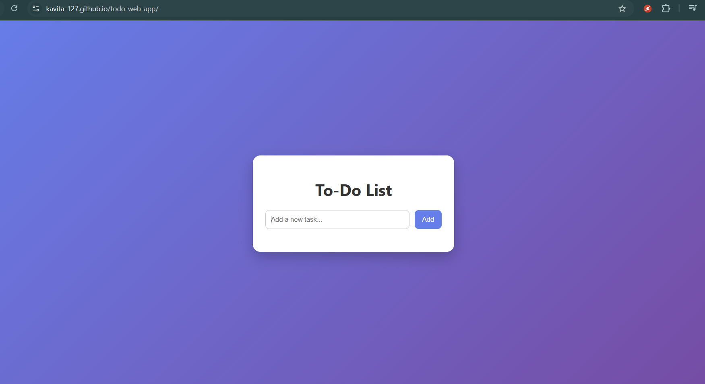
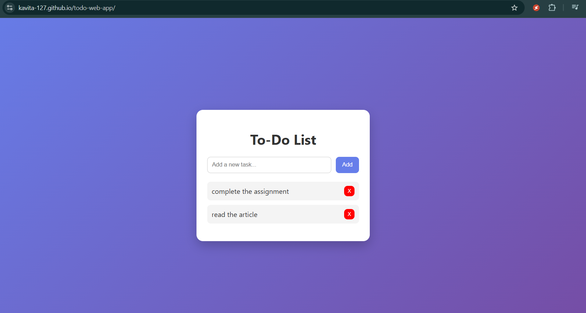

# 📝 To-Do List Web Application

A simple and interactive To-Do List web application built using HTML, CSS, and JavaScript. This app allows users to manage daily tasks efficiently with features like adding, completing, and deleting tasks.

---

## 🚀 Features

- Add new tasks  
- Mark tasks as completed  
- Delete tasks  
- Persistent storage using LocalStorage  
- Add tasks using Enter key  
- Responsive and user-friendly interface  

---

## 🛠️ Tech Stack

- HTML  
- CSS  
- JavaScript  
- LocalStorage (for data persistence)  

---

## 🌐 Live Demo

👉 https://kavita-127.github.io/todo-web-app/

---

## 📸 Screenshots

---

## 📂 Project Structure
todo-web-app/
│── index.html
│── style.css
│── script.js
│── images/

---

## ⚙️ How to Run Locally

1. Clone the repository  

git clone https://github.com/Kavita-127/todo-web-app.git

2. Open the folder  

3. Run `index.html` in your browser  

---

## 🙋‍♀️ Author

**Kavita Pat Pingua**  
- GitHub: https://github.com/Kavita-127  
- LinkedIn: https://linkedin.com/in/kavita-pat-pingua-4bb855224  

---